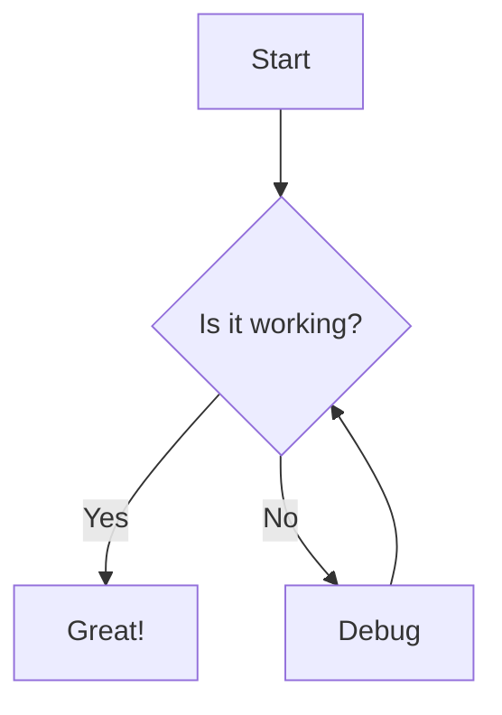

# Obsidian Mermaid Links

A plugin for [Obsidian](https://obsidian.md) that adds convenient "Edit" and "Full Screen" links to all your Mermaid diagrams.

## Features

- Automatically adds links below any Mermaid diagram in your notes
- "Edit" link opens the diagram in [Mermaid Live Editor](https://mermaid.live/edit) for easy modification
- "Full Screen" link opens the diagram in [Mermaid Live Viewer](https://mermaid.live/view) for better visibility
- Customizable link text through plugin settings

## How It Works

The plugin scans your notes for Mermaid code blocks and adds two links below each diagram:

1. **Edit**: Opens the diagram in Mermaid Live Editor, allowing you to modify the diagram in a specialized editor
2. **Full Screen**: Opens the diagram in Mermaid Live Viewer, providing a clean, full-screen view

Both links use Mermaid Live's PAKO compression format to transfer your diagram code efficiently.

## Installation

1. Open Obsidian Settings
2. Go to Community Plugins and disable Safe Mode
3. Click "Browse" and search for "Mermaid Links"
4. Install the plugin and enable it

Or install manually:
- Download the latest release from the [GitHub releases page](https://github.com/vinayaugustine/obsidian-mermaid-links/releases)
- Extract the files into your vault's `.obsidian/plugins/obsidian-mermaid-links` folder
- Reload Obsidian and enable the plugin in the settings

## Configuration

You can customize the text displayed for both links in the plugin settings:

- **Edit Link Text**: The text to display for the edit link (default: "Edit")
- **Full Screen Link Text**: The text to display for the full screen link (default: "Full Screen")

## Usage Example

1. Create a Mermaid diagram in your note:

````markdown

````

2. The plugin automatically adds "Edit" and "Full Screen" links below the diagram
3. Click the "Edit" link to modify your diagram in Mermaid Live Editor
4. Click the "Full Screen" link to view your diagram in a clean, full-screen interface

## Compatibility

- Requires Obsidian v0.15.0 or above
- Works with all standard Mermaid diagram types supported by Obsidian

## License

This project is licensed under the [MIT License](LICENSE).

## Support

If you encounter any issues or have feature requests, please file an issue on the [GitHub repository](https://github.com/vinayaugustine/obsidian-mermaid-links/issues).